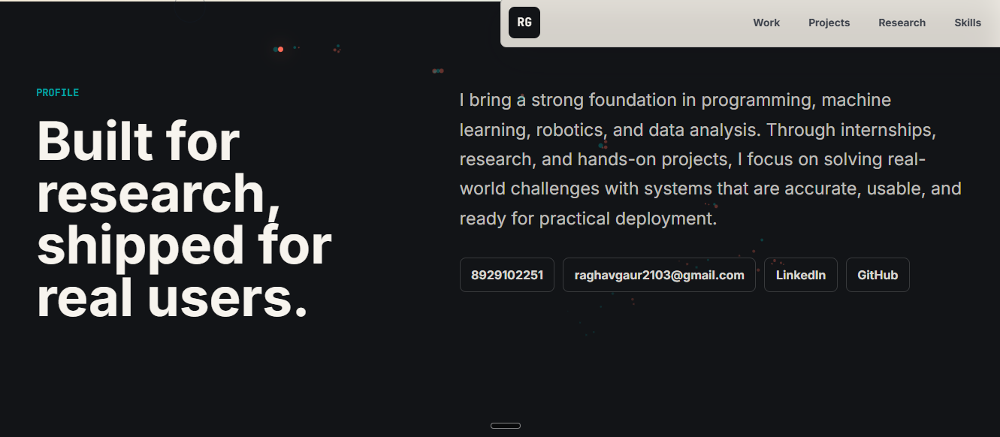

# 🌐 Raghav Gaur  Personal Portfolio

Welcome to my personal portfolio repository! This portfolio showcases my journey as an Artificial Intelligence and Robotics Engineering student, highlighting my projects, research, technical skills, certifications, and achievements.

The website serves as a central hub for recruiters, collaborators, and fellow developers to explore my work in AI, Machine Learning, Deep Learning, Robotics, and Full-Stack Development. It reflects my passion for building intelligent systems and solving real-world problems through technology.

## 🚀 Live Demo

🔗 Portfolio Website https://my-portfolio-1-z0zx.onrender.com/

\---

## ✨ Features

👨‍💻 Professional introduction
🧠 AI \& Machine Learning projects
📄 Research publications
🏆 Certifications and achievements
💼 Technical skills overview
📱 Fully responsive design
📬 Contact information and social links

\---

## 🛠️ Tech Stack

Frontend    Deployment

\---

HTML5       Render  
CSS3        GitHub  
JavaScript

\---

## 🎯 Purpose

This portfolio is designed to showcase my technical expertise, academic projects, research work, and continuous learning journey. It provides an easy way for recruiters, mentors, and collaborators to explore my work and connect with me.

\---


## 📷 Preview

Example



Then use

## 🚀 Running Locally

Clone the repository

```bash
git clone httpsgithub.comraghavvgaurrmy\_portfolio-.git
```

Go to the project directory

```bash
cd my\_portfolio-
```

If it's a static website, simply open `index.html` in your browser.

If you're using Flask

```bash
pip install -r requirements.txt
python app.py
```

\---

## 📫 Connect With Me

🌐 Portfolio https://my-portfolio-1-z0zx.onrender.com/

💼 LinkedIn https://www.linkedin.com/in/raghav-gaur-32a9512a3/

💻 GitHub httpsgithub.comraghavvgaurr

📧 raghavgaur2103@mail.com

\---

⭐ If you like this portfolio, feel free to star the repository!

